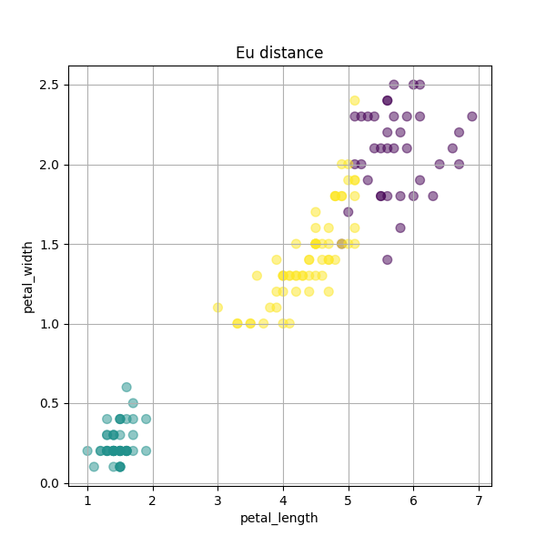
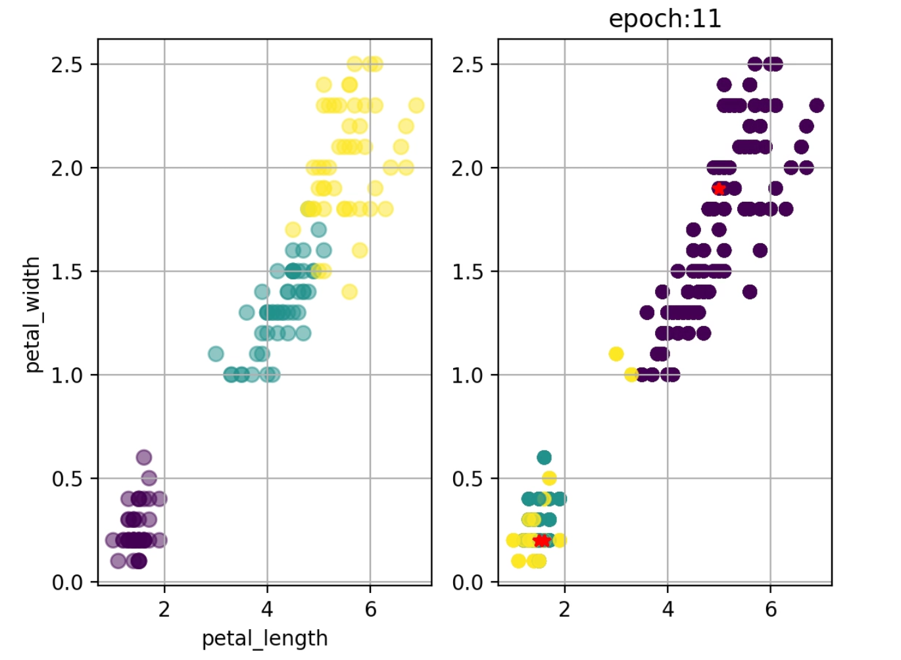
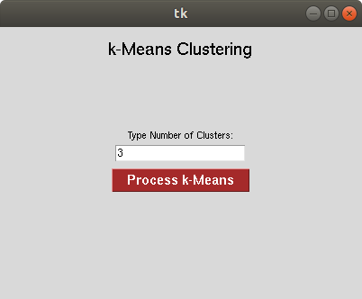
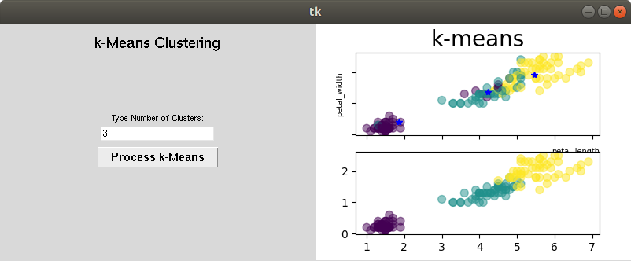

# K-means Implement totaly from scratch
Author : Minegishi Gouki
## Prepare requirement
#### Tested only ubutu18.04 and python=3.8.12
```
pip install numpy 
pip insatll pandas
pip install matplotlib
pip install tkinter # for making gui
```
## Data
#### [iris.csv](https://en.wikipedia.org/wiki/Iris_flower_data_set)
please refer to [utils/EDA.ipynb]()

## Implement K-means
```
python k_means.py -k [k] -d [distance type] -o [output file name] 
```
You can choose distance type below  
- Eu  
  Euclid distance  
- Man
  Manhattan distance  
- Mah
  Maharanovis distance   

You can see source code ../utils/distance.py
## Output value 
You can get output file name image as below.
 
## Visualizing k-means process
I have two idea for visualizing k-means process
- plot animation -> make mp4 file
- gui -> make gui 
## plot animation
```
python animate.py
```
You can get `k-means.mp4` as below  

This animation is maked of Euclid distance and k=3

## make gui
```
python km_gui.py
```
At first, you should enter k (whatever you like) as below.  

Second, You push `Process k-Means` as below.  

You can observe k-mean process.

