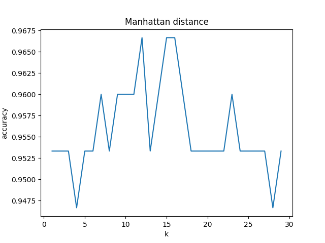

# K nearest neighbor implement totally from scratch
Author : Minegishi Gouki
## Prepare requirement
#### Tested only ubuntu18.04 and python=3.8.12
```
pip install numpy
pip install pandas 
pip install matplotlib
```
## Data
#### [iris.csv](https://en.wikipedia.org/wiki/Iris_flower_data_set)
please refer to [utils/EDA.ipynb]()

## Implement Knn
```
python knn.py -d [distance type] -o [output file name]
```
You can choose distance type below  
- Eu  
  Euclid distance  
- Man
  Manhattan distance  
- Mah
  Maharanovis distance   

You can see source code ../utils/distance.py


## Output value
You can get output file name image as below.  
   
This figure mean relationship between accuracy and k.  

## Result  
- Euclid
  
- Manhattan

- Mahranovis
