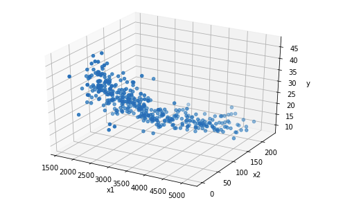

# Linear multiple regression totally from scratch
Author: Minegishi Gouki
## Prepare requirement  
##### tested only ubuntu18.04 and python=3.8.12
```
pip install numpy
pip install pandas
```
## Data  
##### [Auto-mpg.csv](https://archive.ics.uci.edu/ml/datasets/Auto+MPG)
- target columns : mpg
- features : other than mpg   

Auto-mpg have 8 features as below  
This heatmap means Correlation coefficient
  
For example, Relation between mpg and weight,horsepower is below  

x1 is weight, x2 i horsepower, y is mpg.  

## Implement Linear Regression  
```
python regression.py -f feature1 -f feature2 ....
```
You can choose features below
- "weight"
- "horsepower"
- "cylinders"
- "displacement""
- "acceleration"
- "model year"
- "origin"

Each features must be str type

## Result
There are 7 features in this data.  
You can select 127 patterns of input feature combination.  

Top5 feature conbination patterns and L2 loss is below  
```
top1:weight horsepower cylinders displacement acceleration model year origin
loss:32.60449558895282
top2:weight horsepower cylinders displacement model year origin
loss:32.6326942921626
top3:weight horsepower displacement acceleration model year origin
loss:32.70322622161054
top4:weight horsepower displacement model year origin
loss:32.73699057896961
top5:weight horsepower cylinders acceleration model year origin
loss:32.90070363216231
```
